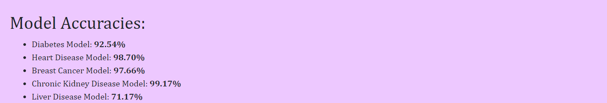

# Smart Disease Predictor
### Introduction
People nowadays suffer from a variety of diseases as a result of their living habits and the state of the environment. As a result, predicting sickness at an early stage becomes a crucial task. A doctor's ability to establish accurate diagnosis solely on symptoms, on the other hand, is restricted. For the prevention and treatment of illness, an accurate and timely examination of any health-related problem is critical and challenging. In the case of a critical illness, the conventional method of diagnosis may not be adequate. There will be a huge requirement for Automated Disease Prediction System that will reduce these challenges.

In this project I used different models to predict the chances of a patient to have diabetes, breast-cancer, liver, heart and kidney diseases.

## Sample images of the web application

### Home Page

 

### Diabetes Predictor

 

### Breast Cancer Predictor

 

### Negative Result Page

 

### Positive Result Page

